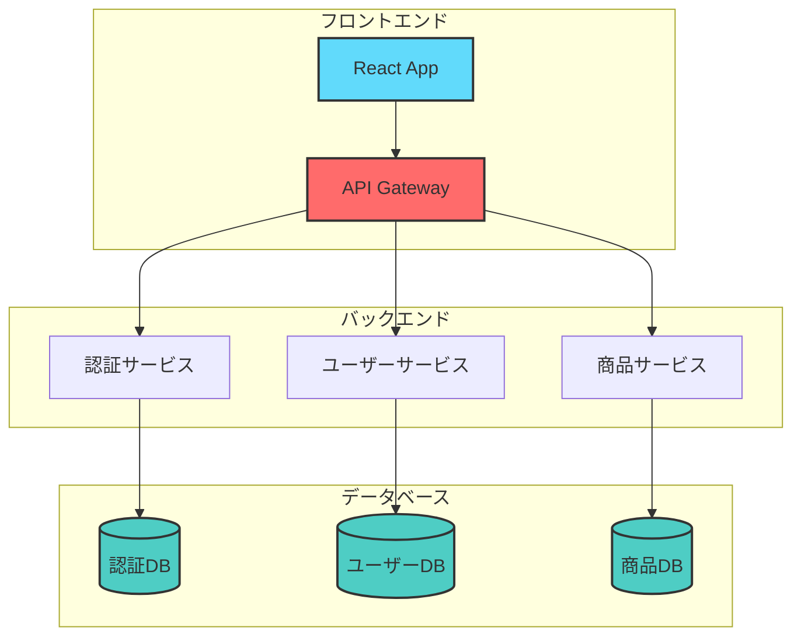
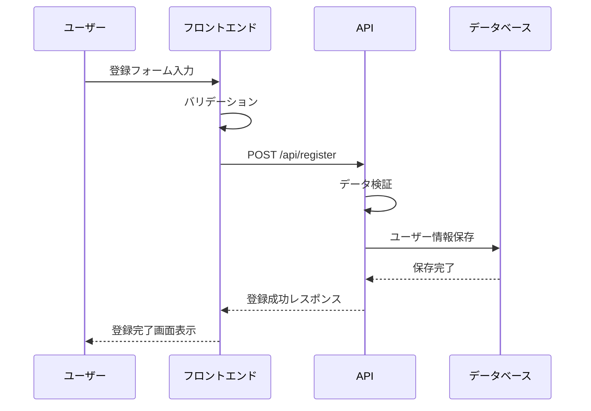
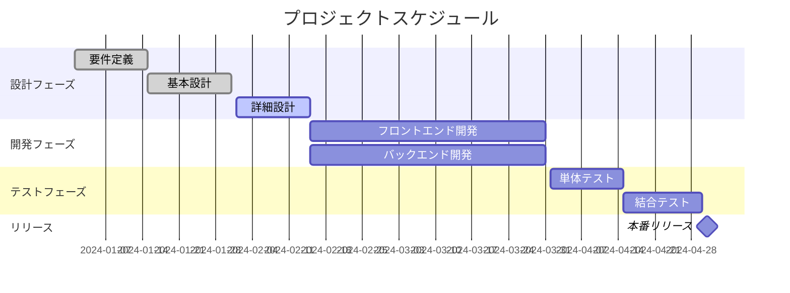
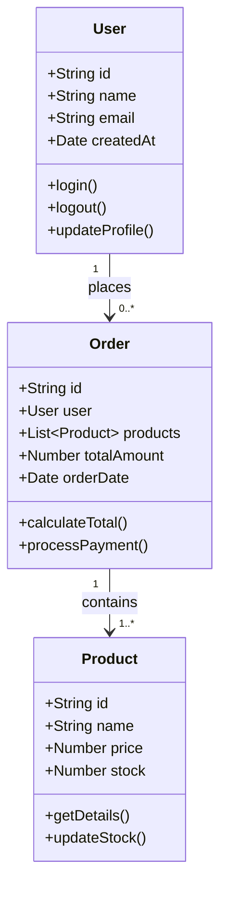
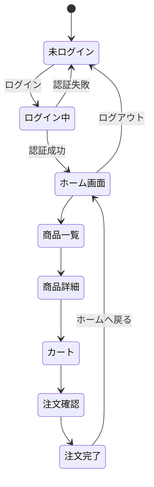
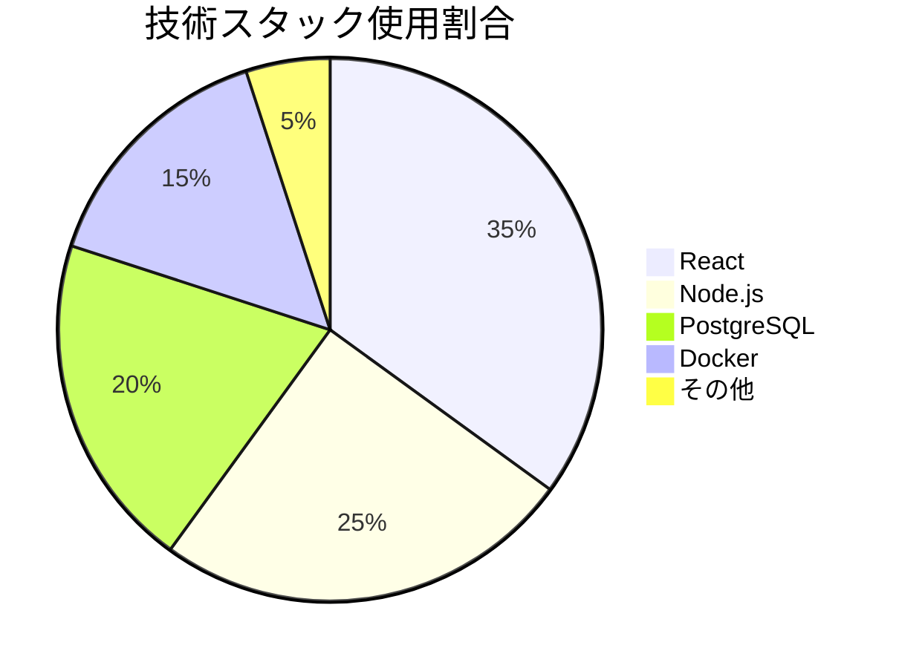

# プロジェクト設計図

## システム構成図

```mermaid
graph TB
    subgraph "フロントエンド"
        A[React App] --> B[API Gateway]
    end
    
    subgraph "バックエンド"
        B --> C[認証サービス]
        B --> D[ユーザーサービス]
        B --> E[商品サービス]
    end
    
    subgraph "データベース"
        C --> F[(認証DB)]
        D --> G[(ユーザーDB)]
        E --> H[(商品DB)]
    end
    
    style A fill:#61dafb,stroke:#333,stroke-width:2px
    style B fill:#ff6b6b,stroke:#333,stroke-width:2px
    style F fill:#4ecdc4,stroke:#333,stroke-width:2px
    style G fill:#4ecdc4,stroke:#333,stroke-width:2px
    style H fill:#4ecdc4,stroke:#333,stroke-width:2px
```

## ユーザー登録フロー

```mermaid
sequenceDiagram
    participant U as ユーザー
    participant F as フロントエンド
    participant A as API
    participant DB as データベース
    
    U->>F: 登録フォーム入力
    F->>F: バリデーション
    F->>A: POST /api/register
    A->>A: データ検証
    A->>DB: ユーザー情報保存
    DB-->>A: 保存完了
    A-->>F: 登録成功レスポンス
    F-->>U: 登録完了画面表示
```

## プロジェクトのガントチャート

```mermaid
gantt
    title プロジェクトスケジュール
    dateFormat YYYY-MM-DD
    section 設計フェーズ
    要件定義           :done,    des1, 2024-01-01, 2024-01-15
    基本設計           :done,    des2, 2024-01-15, 2024-01-31
    詳細設計           :active,  des3, 2024-02-01, 2024-02-15
    
    section 開発フェーズ
    フロントエンド開発  :         dev1, 2024-02-15, 2024-03-31
    バックエンド開発    :         dev2, 2024-02-15, 2024-03-31
    
    section テストフェーズ
    単体テスト         :         test1, 2024-04-01, 2024-04-15
    結合テスト         :         test2, 2024-04-15, 2024-04-30
    
    section リリース
    本番リリース       :milestone, 2024-05-01, 0d
```

## クラス図

```mermaid
classDiagram
    class User {
        +String id
        +String name
        +String email
        +Date createdAt
        +login()
        +logout()
        +updateProfile()
    }
    
    class Product {
        +String id
        +String name
        +Number price
        +Number stock
        +getDetails()
        +updateStock()
    }
    
    class Order {
        +String id
        +User user
        +List~Product~ products
        +Number totalAmount
        +Date orderDate
        +calculateTotal()
        +processPayment()
    }
    
    User "1" --> "0..*" Order : places
    Order "1" --> "1..*" Product : contains
```

## 状態遷移図

```mermaid
stateDiagram-v2
    [*] --> 未ログイン
    未ログイン --> ログイン中 : ログイン
    ログイン中 --> ホーム画面 : 認証成功
    ログイン中 --> 未ログイン : 認証失敗
    
    ホーム画面 --> 商品一覧
    商品一覧 --> 商品詳細
    商品詳細 --> カート
    カート --> 注文確認
    注文確認 --> 注文完了
    
    ホーム画面 --> 未ログイン : ログアウト
    注文完了 --> ホーム画面 : ホームへ戻る
```

## 円グラフ

```mermaid
pie title 技術スタック使用割合
    "React" : 35
    "Node.js" : 25
    "PostgreSQL" : 20
    "Docker" : 15
    "その他" : 5
```